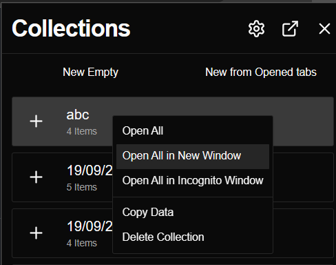
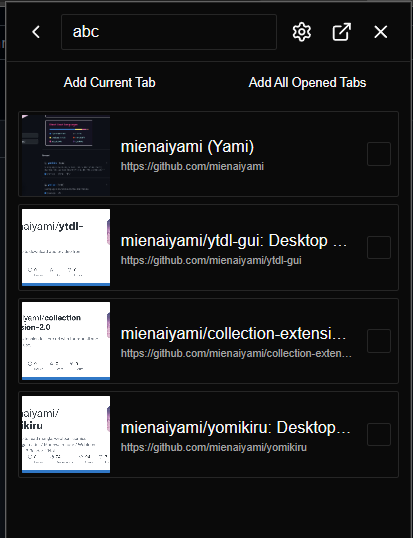
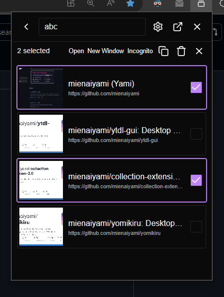
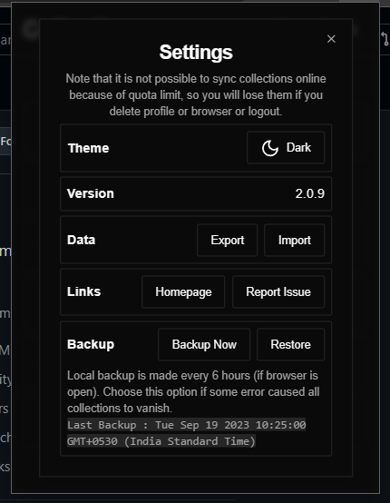

# Collection extension for chromium based browser

Enhanced version of <https://github.com/mienaiyami/collections-chrome-extension>

It is recommended to use store version for auto updates (but version is only updated after around 10days of releasing).

<!-- If you want to try this extension, download `build.zip` from releases and unzip it, open extension option in your browser, enable developer mode, load unpacked and select extracted `/dist`. You can turn off developer mode now. -->

Microsoft Edge Store Link (works in all chromium browser) : <https://microsoftedge.microsoft.com/addons/detail/collections/fpolmkmcokpklimmekilomdghljpmpcf>

> Microsoft Edge extension updates usually take over 7 days. So it is possible for important updates to longer to be delivered.

Chrome Store : <https://chromewebstore.google.com/detail/collections/kcijpmmfajideceadmcihckmodaiehpm>

> I recommend using Chrome store to get benefits of online backup (will be implemented soon.)

Local (**NO AUTO UPDATES**) : download `build.zip` from releases and unzip it, open extension option in your browser, enable developer mode, load unpacked and select extracted `/dist`. You can turn off developer mode now.

## Features

- create collection from all opened tabs.
- works as side-panel (v2.0.17 onwards).
- select and open urls in batch.
- works in incognito.
- shortcut keys for quick actions.
- export,import, backup data.
- more.

## Todo

- online synced collection.
- better shortcuts.
- selectable collections (similar to links inside collection).

## Shortcut keys

- use tab to navigate.
- inside collection
- | keys | action |
    |---|---|
    |`alt + arrowLeft` | go back|
    |`delete` | delete |
    | `t` | open in new tab|
    | `n` | open in new window |
    | `shift + n` | open in incognito|
    | `escape` | deselect items |
    | `ctrl + a` | select all |
    | `c` | copy urls |

## Screenshots

<https://github.com/mienaiyami/collection-extension-2.0/assets/84740082/1f2b496e-30eb-46e8-977b-dbd5daa671db>

